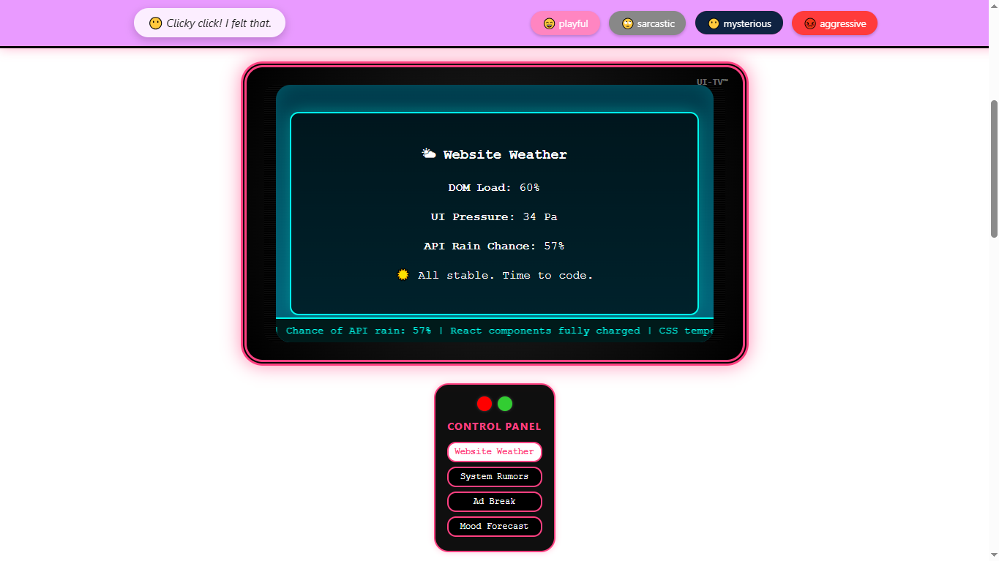
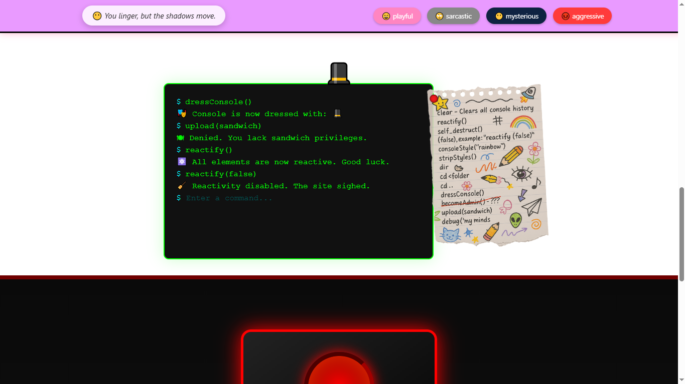

# 🧨 Not Troll React App

A mischievous React + Vite web experience designed to showcase CSS mastery, dramatic UI behavior, and elements that constantly attempt to troll the user — with flair and surprise.
⚠️OPEN ONLY ON PC

## ⚠️ Epilepsy Warning

This site contains flashing visuals, high-contrast animations, and abrupt color transitions. It may pose risks for individuals with photosensitive epilepsy.

## 🎭 Live Demo

👉 [https://Reshatel.github.io/Not-Troll-React-App](https://Reshatel.github.io/Not-Troll-React-App)




## 💥 Features

* 🎭 **Mood-Sensitive Header**  
  A sentient header that responds emotionally to user behavior — commenting, judging, reacting.

* 🔘 **Annoying Button**  
  A hyperactive button that dodges interaction and makes clicking a psychological game.

* 📺 **VHS Television**  
  Retro-styled display with multiple bizarre “channels” — left unexplained for dramatic effect.

* 💻 **Working Terminal**  
  A fake (but interactive) command line with random commands, Easter eggs, and chaos.

* 🎁 **Hidden Oddities**  
  Unlisted components scattered across the UI. You'll know when you meet them... or they meet you.

## 🧪 Built With

* [React](https://react.dev/)
* [Vite](https://vitejs.dev/)
* Raw CSS & glitchy animation logic
* GitHub Pages deployment

## 🚀 Setup & Local Dev

```bash
npm install
npm run dev
